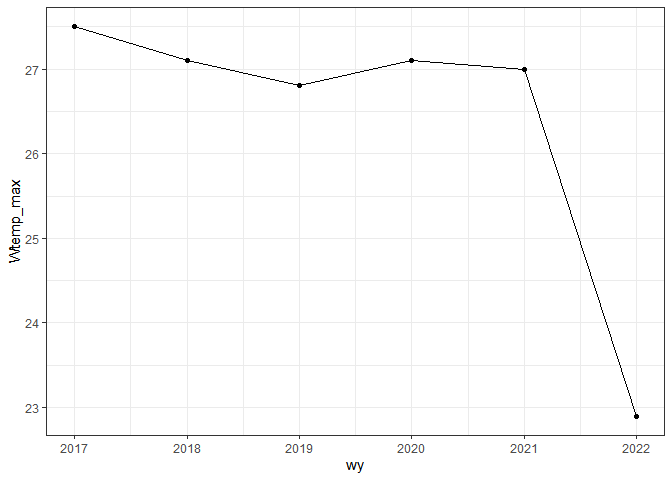

<!-- README.md is generated from README.Rmd. Please edit that file -->

# whitewater

<!-- badges: start -->

[](https://github.com/joshualerickson/whitewater/actions)[](https://app.codecov.io/gh/joshualerickson/whitewater)
<!-- badges: end -->

The goal of whitewater is to provide chunk-based parallelism for water
relevant APIs (USGS, NRCS, NWS).

## Installation

You can install the development version of whitewater from
[GitHub](https://github.com/) with:

``` r
# install.packages("devtools")
devtools::install_github("joshualerickson/whitewater")
```

## Example

This is a basic example which shows you how to solve a common problem:
get minimum flows per water year.

``` r
library(whitewater)
library(ggplot2)
## basic example code

yaak_min <- ww_wyUSGS(sites = '12304500')
#> v 'water year' was successfully downloaded.
#> > now starting to gather peak flows using dataRetrieval::readNWISpeak
#> v 12304500 'peak flows' were successfully downloaded.

ggplot(yaak_min, aes(wy, Flow_min)) +
  geom_point() + 
  geom_line() +
  theme_bw()
```

 ### Or
minimum/maximum water temperature

``` r
withlacoochee_temp <- ww_wyUSGS(sites="02319394",
                          parameter_cd = c("00010"))
#> v 'water year' was successfully downloaded.

ggplot(withlacoochee_temp, aes(wy, Wtemp_min)) +
  geom_point() + 
  geom_line() +
  theme_bw()
```


``` r
ggplot(withlacoochee_temp, aes(wy, Wtemp_max)) +
  geom_point() + 
  geom_line() +
  theme_bw()
```


