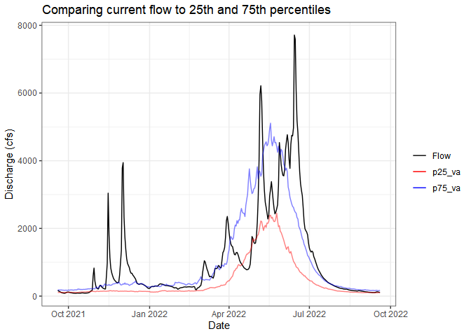

<!-- README.md is generated from README.Rmd. Please edit that file -->

# whitewater

<!-- badges: start -->
[](https://CRAN.R-project.org/package=whitewater)
[](https://github.com/joshualerickson/whitewater/actions)[](https://app.codecov.io/gh/joshualerickson/whitewater)
[](https://lifecycle.r-lib.org/articles/stages.html#stable)
<!-- badges: end -->

The goal of whitewater is to provide sequential and parallel processing
for USGS stations in a tidy-style format. This package allows user to
`plan()` their choice of parallel processing and then use the argument
`parallel = TRUE` in whitewater function calls. The package also puts
every output in a `tibble` with data munging of sites, parameter and
stat codes, which results in a **tidy** style data frame.

## Attention!

**Please read the new information about USGS Water Services via [{dataRetrieval}](https://github.com/DOI-USGS/dataRetrieval).
I will try to get this updated as soon as I can, thank you for your patience!**

**Due to potentially crashing [(USGS Water Services)](https://waterservices.usgs.gov/) REST services parallel
processing is kept to 120 requests/min. By following this rate limit, we
can still benefit from parallel processing but also being
mindful/respectful to the USGS Water Services via
[{dataRetrieval}](https://github.com/DOI-USGS/dataRetrieval) and REST
services. Thank you!**

## Installation

You can install the development version of whitewater from
[GitHub](https://github.com/) with:

``` r
# install.packages("devtools")
devtools::install_github("joshualerickson/whitewater")
```

## Example

This is a basic example which shows you how to solve a common problem:
get daily values of discharge for multiple sites (all active sites in
Pacific Northwest (Region 17)) using parallel processing. Please see
[furrr](https://CRAN.R-project.org/package=furrr) and [future](https://CRAN.R-project.org/package=future) for
more details on parallel processing methods.

### Running in parallel

``` r
library(whitewater)
library(tidyverse)
library(sf)
library(future)
library(dataRetrieval)

huc17_sites <- dataRetrieval::whatNWISdata(huc = 17,
                                           siteStatus = 'active',
                                           service = 'dv',
                                           parameterCd = '00060',
                                           drainAreaMax = 2000)
cat("# of sites: ", nrow(huc17_sites))
#> # of sites:  675

st_as_sf(huc17_sites, coords = c('dec_long_va', 'dec_lat_va')) %>% 
  ggplot() + 
  geom_sf() +
  borders('state', xlim = c(-130, -110), ylim = c(20, 50)) + 
  theme_bw()
```


``` r
#need to call future::plan()

##### Remember, please use 10 or less workers #####
plan(multisession(workers = 11))

#running on 11 cores

system.time({
pnw_dv <- ww_dvUSGS(huc17_sites$site_no,
                    parameter_cd = '00060',
                    wy_month = 10,
                    parallel = TRUE,
                    verbose = FALSE)
})
#>    user  system elapsed 
#>   39.96    2.47  559.56

nrow(pnw_dv)
#> [1] 11752061

pnw_dv
#> # A tibble: 11,752,061 x 28
#>    Station site_no drainage_area   lat  long altitude agency_cd Date        Flow
#>    <chr>   <chr>           <dbl> <dbl> <dbl>    <dbl> <chr>     <date>     <dbl>
#>  1 DONNER~ 103960~          124.  42.8 -119.     4254 USGS      1911-04-01   160
#>  2 DONNER~ 103960~          124.  42.8 -119.     4254 USGS      1911-04-02   166
#>  3 DONNER~ 103960~          124.  42.8 -119.     4254 USGS      1911-04-03   173
#>  4 DONNER~ 103960~          124.  42.8 -119.     4254 USGS      1911-04-04   180
#>  5 DONNER~ 103960~          124.  42.8 -119.     4254 USGS      1911-04-05   187
#>  6 DONNER~ 103960~          124.  42.8 -119.     4254 USGS      1911-04-06   232
#>  7 DONNER~ 103960~          124.  42.8 -119.     4254 USGS      1911-04-07   207
#>  8 DONNER~ 103960~          124.  42.8 -119.     4254 USGS      1911-04-08   182
#>  9 DONNER~ 103960~          124.  42.8 -119.     4254 USGS      1911-04-09   157
#> 10 DONNER~ 103960~          124.  42.8 -119.     4254 USGS      1911-04-10   132
#> # ... with 11,752,051 more rows, and 19 more variables: Flow_cd <chr>,
#> #   STILLING.WELL_Flow <dbl>, STILLING.WELL_Flow_cd <chr>,
#> #   .Estimated.By.Regression._Flow <dbl>,
#> #   .Estimated.By.Regression._Flow_cd <chr>, ..2.._Flow <dbl>,
#> #   ..2.._Flow_cd <chr>, .Discharge.1921.to.1952._Flow <dbl>,
#> #   .Discharge.1921.to.1952._Flow_cd <chr>, year <dbl>, month <dbl>, day <int>,
#> #   doy <dbl>, wy_doy <dbl>, month_day <chr>, wy <int>, month_abb <fct>, ...
```

Now we can use other `ww_` functions to filter the data by water year,
month, water year and month, as well as stat reporting (percentiles
comparing current readings).

### Water Year

Same as above, we can just call `parallel = TRUE` to run in parallel
since we’ll be getting peak flows from `dataRetrieval::readNWISpeak()`.

``` r
system.time({
pnw_wy <- suppressMessages(ww_wyUSGS(pnw_dv,
                                     parallel = TRUE,
                                     verbose = FALSE))
})
#>    user  system elapsed 
#>   16.86    0.72  418.25

pnw_wy
#> # A tibble: 32,663 x 27
#>    Station   site_no    wy peak_va peak_dt    drainage_area   lat  long altitude
#>    <chr>     <chr>   <int>   <dbl> <date>             <dbl> <dbl> <dbl>    <dbl>
#>  1 ABIQUA C~ 142007~  2014      NA NA                  45.3  45.0 -123.      193
#>  2 ABIQUA C~ 142007~  2015    3330 2014-12-21          45.3  45.0 -123.      193
#>  3 ABIQUA C~ 142007~  2016    5980 2015-12-07          45.3  45.0 -123.      193
#>  4 ABIQUA C~ 142007~  2017    3740 2017-03-09          45.3  45.0 -123.      193
#>  5 ABIQUA C~ 142007~  2018    4290 2017-10-22          45.3  45.0 -123.      193
#>  6 ABIQUA C~ 142007~  2019    3700 2019-04-07          45.3  45.0 -123.      193
#>  7 ABIQUA C~ 142007~  2020    2600 2020-01-28          45.3  45.0 -123.      193
#>  8 ABIQUA C~ 142007~  2021    5360 2020-12-20          45.3  45.0 -123.      193
#>  9 ABIQUA C~ 142007~  2022      NA NA                  45.3  45.0 -123.      193
#> 10 AHTANUM ~ 125025~  1904      NA NA                 107.   46.5 -120.      940
#> # ... with 32,653 more rows, and 18 more variables: obs_per_wy <int>,
#> #   wy_count <int>, Flow_sum <dbl>, Flow_max <dbl>, Flow_min <dbl>,
#> #   Flow_mean <dbl>, Flow_median <dbl>, Flow_stdev <dbl>, Flow_coef_var <dbl>,
#> #   Flow_max_dnorm <dbl>, Flow_min_dnorm <dbl>, Flow_mean_dnorm <dbl>,
#> #   Flow_med_dnorm <dbl>, Flow_max_sdnorm <dbl>, Flow_min_sdnorm <dbl>,
#> #   Flow_mean_sdnorm <dbl>, Flow_med_sdnorm <dbl>, Flow_sd_norm <dbl>
```


### Without using parallel

If you just want a few sites (or one) and not use parallel processing,
go for it! You’ll still get the advantages of filtering and stats. In
addition, You don’t always have to pipe a `ww_dvUSGS()` object into the
`ww_*()` and can just use the `sites` argument. In the example below
I’ll do this but IMO its nice to start with a `ww_dvUSGS()` object
because you’ll likely come back to it.

``` r
withlacoochee_temp_and_flow <- ww_wyUSGS(sites="02319394",
                          parameter_cd = c("00010", "00060"))
#> v 'water year' was successfully downloaded.
#> > now starting to gather peak flows using dataRetrieval::readNWISpeak
#> v 02319394 'peak flows' were successfully downloaded.

withlacoochee_temp_and_flow %>% 
  pivot_longer(c('Wtemp_max', 'Flow_max')) %>% 
ggplot(aes(wy, value)) +
  geom_point() + 
  geom_line() +
  theme_bw() +
  labs(x = 'Water Year') +
  facet_wrap(~name, scale = 'free')
```


### Stats

Sometimes you just want to compare the current flow (water year or past
week, whatever you want) to historical flows. The `ww_statsUSGS()`
function does this for you! It takes the historical values for your
parameter (flow in this example) and returns percentiles
(`dataRetrieval::readNWISstat()`) but also combines the current values.

``` r
yaak_river_dv <- ww_dvUSGS('12304500')
#> v Yaak River near Troy MT 'daily' was successfully downloaded.

yaak_daily_report <- ww_statsUSGS(yaak_river_dv, 
                                  temporalFilter = 'daily',
                                  days = 365)
#> v Yaak River near Troy MT 'NWIS Stat' for Temporal Filter (daily) was successfully downloaded.
yaak_daily_report %>% 
  pivot_longer(c('Flow', 'p25_va', 'p75_va')) %>% 
  ggplot() + 
  geom_line(aes(Date, value, color = name, alpha = name %in% c('p25_va', 'p75_va'))) + 
  scale_color_manual(values = c('black', 'red', 'blue')) +
  scale_alpha_manual(values = c(1,.5), guide = 'none') +
  labs(y = 'Discharge (cfs)', color = '', title = 'Comparing current flow to 25th and 75th percentiles') + 
  theme_bw()
```


