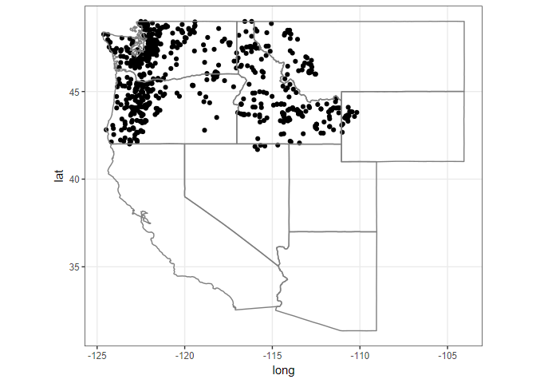

<!-- README.md is generated from README.Rmd. Please edit that file -->

# whitewater

<!-- badges: start -->

[](https://github.com/joshualerickson/whitewater/actions)[](https://app.codecov.io/gh/joshualerickson/whitewater)
<!-- badges: end -->

The goal of whitewater is to provide sequential and parallel processing
for USGS stations in a tidy-style format.

## Installation

You can install the development version of whitewater from
[GitHub](https://github.com/) with:

``` r
# install.packages("devtools")
devtools::install_github("joshualerickson/whitewater")
```

## Example

This is a basic example which shows you how to solve a common problem:
get daily values of discharge for multiple sites (all active sites in
Pacific Northwest (Region 17)) using parallel processing. Please see
[furrr](https://cran.r-project.org/web/packages/furrr/index.html) and
[future](https://cran.r-project.org/web/packages/future/index.html) for
more details on parallel processing methods.

### Running in parallel

``` r
library(whitewater)
library(tidyverse)
library(sf)
library(future)

huc17_sites <- dataRetrieval::whatNWISdata(huc = 17,
                                           siteStatus = 'active',
                                           service = 'dv',
                                           parameterCd = '00060')

st_as_sf(huc17_sites, coords = c('dec_long_va', 'dec_lat_va')) %>% 
  ggplot() + 
  geom_sf() +
  borders('state', xlim = c(-130, -110), ylim = c(20, 50)) + 
  theme_bw()
```



``` r
#need to call future::plan()
plan(multisession(workers = availableCores()-1))

#running on 11 cores

system.time({
pnw_dv <- suppressMessages(ww_dvUSGS(huc17_sites$site_no,
                    parameter_cd = '00060',
                    wy_month = 10,
                    parallel = TRUE))
})
#>    user  system elapsed 
#>   36.14    2.41  259.94
```

Now we can use other `ww_` functions to filter the data by water year,
month, water year and month, as well as stat reporting (percentiles
comparing current readings).

### Water Year

Same as above, we can just call `parallel = TRUE` to run in parallel
since we’ll be getting peak flows from `dataRetrieval::readNWISpeak()`.

``` r
system.time({
pnw_wy <- suppressWarnings(suppressMessages(ww_wyUSGS(pnw_dv,
                                     parallel = TRUE)))
})
#>    user  system elapsed 
#>   15.51    0.50   71.64
```

    #> Warning: `cols` is now required when using unnest().
    #> Please use `cols = c(data, model)`
    #> `geom_smooth()` using formula 'y ~ x'
    #> Warning: Removed 128 rows containing non-finite values (stat_smooth).


    #> Warning: `cols` is now required when using unnest().
    #> Please use `cols = c(data, model)`


### Without using parallel

If you just want a single site, go for it!

``` r
yaak_min <- ww_wyUSGS(sites = '12304500')
#> v 'water year' was successfully downloaded.
#> > now starting to gather peak flows using dataRetrieval::readNWISpeak
#> v 12304500 'peak flows' were successfully downloaded.

ggplot(yaak_min, aes(wy, Flow_min)) +
  geom_point() + 
  geom_line() +
  theme_bw()
```


### Or minimum/maximum water temperature

``` r
withlacoochee_temp <- ww_wyUSGS(sites="02319394",
                          parameter_cd = c("00010"))
#> v 'water year' was successfully downloaded.

ggplot(withlacoochee_temp, aes(wy, Wtemp_min)) +
  geom_point() + 
  geom_line() +
  theme_bw()
```


``` r
ggplot(withlacoochee_temp, aes(wy, Wtemp_max)) +
  geom_point() + 
  geom_line() +
  theme_bw()
```


